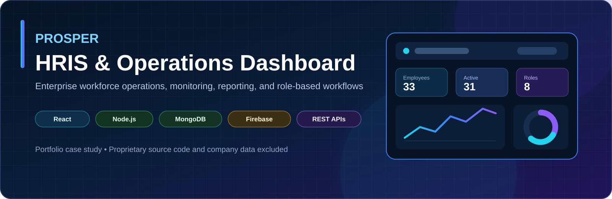
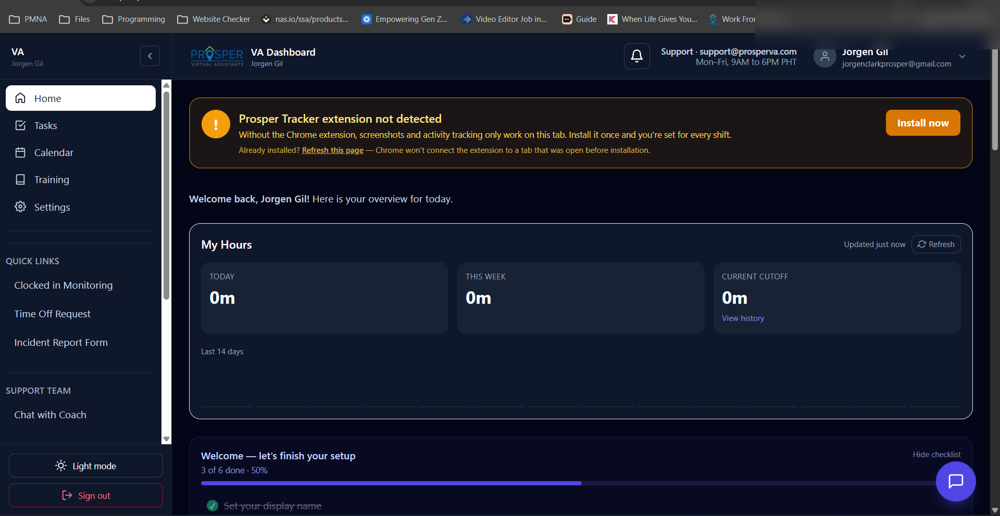
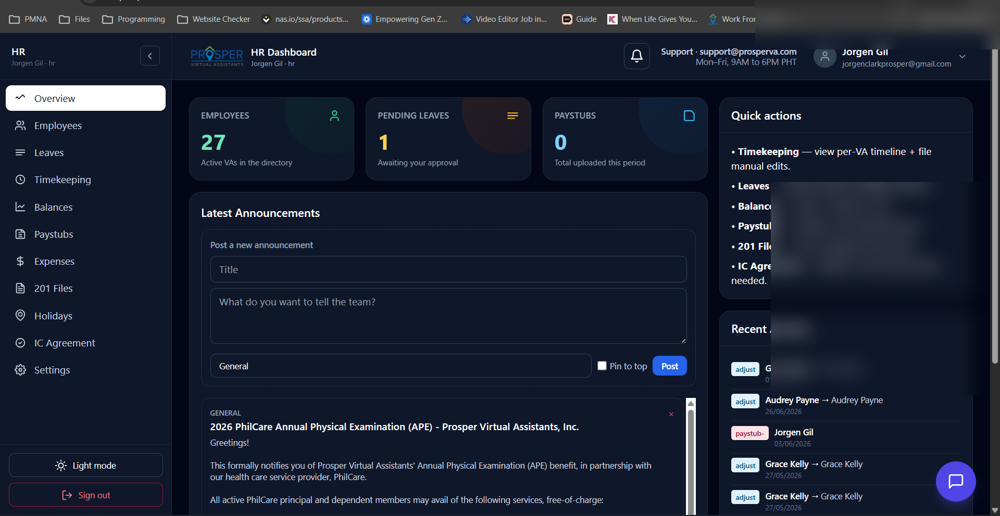
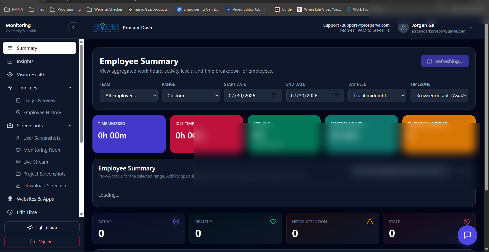
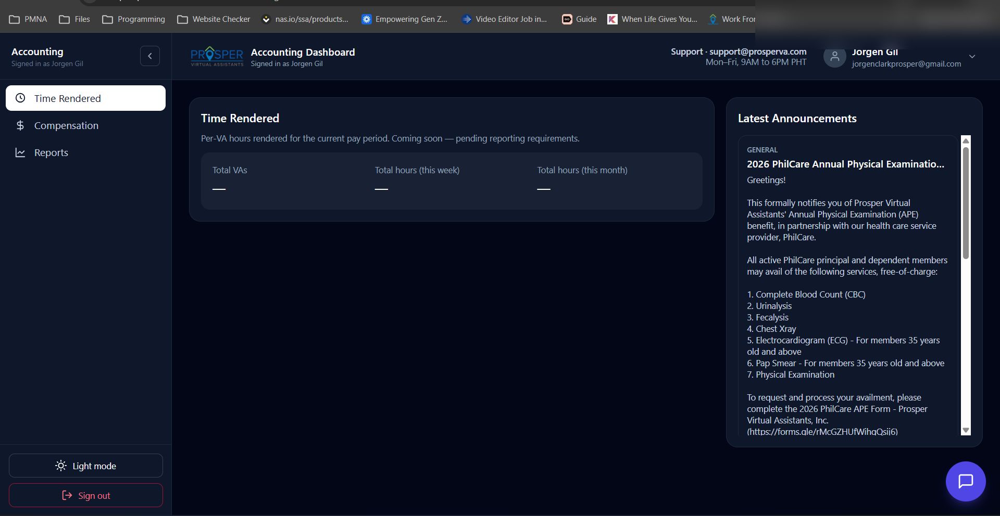
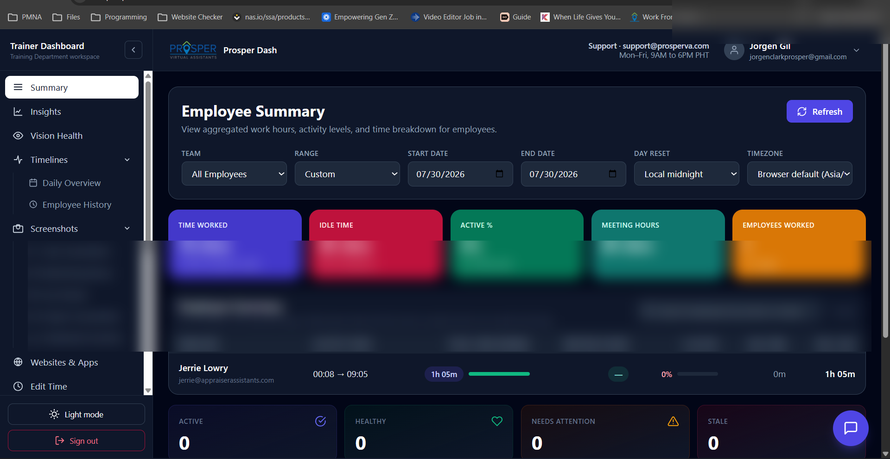
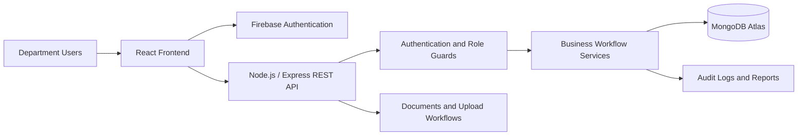

<p align="center">
  
</p>

<h1 align="center">Prosper HRIS &amp; Operations Dashboard</h1>

<p align="center">
  A portfolio case study of an internal workforce operations platform built with React, Node.js, Express, MongoDB, and Firebase.
</p>

<p align="center">
  
  
  
  
  
</p>

> [!IMPORTANT]
> This repository is a **portfolio case study**, not the production codebase. Proprietary source code, credentials, private business rules, internal documents, and employee data are intentionally excluded.

## Overview

Prosper HRIS centralizes workforce and operational workflows in one role-based web application. The platform supports multiple departments with dedicated dashboards, protected routes, employee workflows, monitoring, time data, reports, documents, and administrative controls.

| Area | What the platform supports |
|---|---|
| **Workforce operations** | Employee workflows, attendance, time records, leave balances, holidays, documents, and payroll-related processes |
| **Department dashboards** | Admin, HR, VA, Monitoring, Accounting, Coordinator, Trainer, and client-facing views |
| **Security** | Firebase authentication, protected routes, backend authorization guards, and role-based permissions |
| **Reporting** | Operational summaries, monitoring views, audit logs, and export-ready reporting workflows |
| **Reliability** | QA, responsive layouts, API error handling, debugging, and production maintenance |

## Application Preview

<table>
  <tr>
    <td width="50%" valign="top">
      <strong>Secure Authentication</strong><br><br>
      
      <br><sub>Firebase-backed authentication and protected access.</sub>
    </td>
    <td width="50%" valign="top">
      <strong>VA Dashboard</strong><br><br>
      
      <br><sub>Tasks, calendar, training, settings, and work-hour overview.</sub>
    </td>
  </tr>
  <tr>
    <td width="50%" valign="top">
      <strong>HR Dashboard</strong><br><br>
      
      <br><sub>Employee records, leaves, attendance, payroll, and HR operations.</sub>
    </td>
    <td width="50%" valign="top">
      <strong>Monitoring Dashboard</strong><br><br>
      
      <br><sub>Employee summaries, activity metrics, meetings, and operational monitoring.</sub>
    </td>
  </tr>
  <tr>
    <td width="50%" valign="top">
      <strong>Accounting Dashboard</strong><br><br>
      
      <br><sub>Time-rendered summaries, compensation workflows, and reports.</sub>
    </td>
    <td width="50%" valign="top">
      <strong>Trainer Dashboard</strong><br><br>
      
      <br><sub>Employee summaries, training workflows, reports, and resource management.</sub>
    </td>
  </tr>
</table>

## Core Capabilities

### Role-based experiences

- Dedicated interfaces for Admin, HR, VA, Monitoring, Accounting, Coordinator, Trainer, and client users
- Protected frontend routes and backend authorization guards
- User approval, status management, permission handling, and audit logging

### Workforce and HR operations

- Employee profiles and records
- Attendance and time-rendered workflows
- Leave requests, balances, and holidays
- Payroll periods and reporting
- Document uploads and expiration alerts
- Memos, assets, and administrative records

### Monitoring and reporting

- Employee activity and work-hour summaries
- Date-range operational views
- Monitoring dashboards and drill-down pages
- Audit logs and reporting exports
- Responsive interfaces for day-to-day operational use

## System Architecture



### Request flow

1. A user signs in through Firebase Authentication.
2. The frontend sends the authentication token with API requests.
3. Express middleware verifies identity and enforces role permissions.
4. Business services validate and process workflow rules.
5. MongoDB stores application records, while audit and reporting layers capture relevant activity.

## Technology Stack

| Layer | Technologies |
|---|---|
| **Frontend** | React, JavaScript, Tailwind CSS |
| **Backend** | Node.js, Express |
| **Database** | MongoDB Atlas, Mongoose |
| **Authentication** | Firebase Authentication |
| **Integration** | REST APIs |
| **Deployment and delivery** | Render, Vercel, Cloudflare |
| **Development practices** | Responsive UI, QA, debugging, API validation, error handling |

## My Contributions

I worked across the application stack, translating operational requirements into usable and maintainable product features.

- Built and refined React pages, dashboards, and reusable workflow components
- Developed and integrated Node.js and Express REST endpoints
- Implemented Firebase authentication and role-based authorization
- Designed and maintained MongoDB and Mongoose data models
- Delivered HR, monitoring, time-tracking, reporting, audit-log, document, leave, holiday, and payroll-related features
- Diagnosed authentication, routing, deployment, API, and data-consistency issues
- Improved mobile responsiveness, workflow reliability, and usability through QA
- Maintained and enhanced a production-oriented internal system

## Engineering Challenges Addressed

- Keeping role permissions consistent across frontend routes and backend APIs
- Coordinating Firebase identity with application-level user records and roles
- Designing reusable workflows for multiple departments with different operational needs
- Maintaining consistent data across monitoring, attendance, payroll, and reporting modules
- Improving reliability while the platform continued to evolve in production
- Protecting proprietary information while documenting the project publicly

## Repository Contents

```text
.
├── assets/
│   └── prosper-banner.svg
├── screenshots/
│   ├── accounting-dashboard.png
│   ├── hr-dashboard.png
│   ├── login.png
│   ├── monitoring-dashboard.png
│   ├── trainer-dashboard.png
│   ├── va-dashboard.png
│   └── README.md
└── README.md
```

## Confidentiality and Source Availability

This project was completed in a professional company environment. The production source code, credentials, internal documents, private employee information, company assets, and proprietary business rules are not distributed through this repository.

The material presented here is limited to sanitized screenshots, high-level architecture, technical context, and a description of my engineering contributions.

## Contact

- **Portfolio:** [jorgen-fosgate.jorgengilfosgate.workers.dev](https://jorgen-fosgate.jorgengilfosgate.workers.dev)
- **GitHub:** [github.com/Zackirito14](https://github.com/Zackirito14)
- **LinkedIn:** [Jorgen Gil F. Fosgate](https://www.linkedin.com/in/jorgen-gil-fosgate-000a391b4/)

<p align="center">
  Built and documented by <strong>Jorgen Gil F. Fosgate</strong>
</p>
